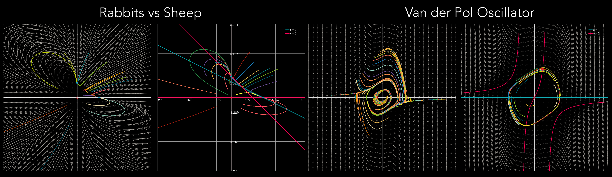
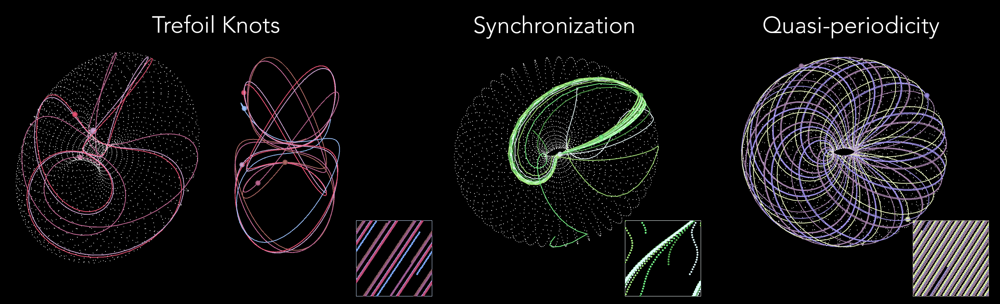
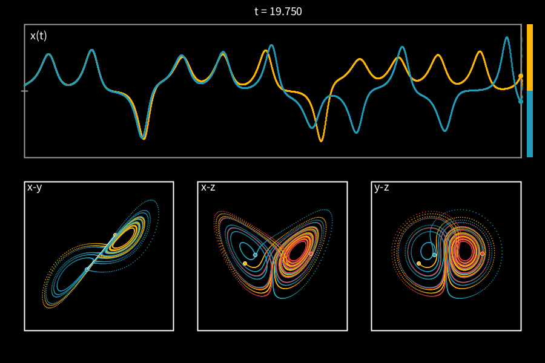
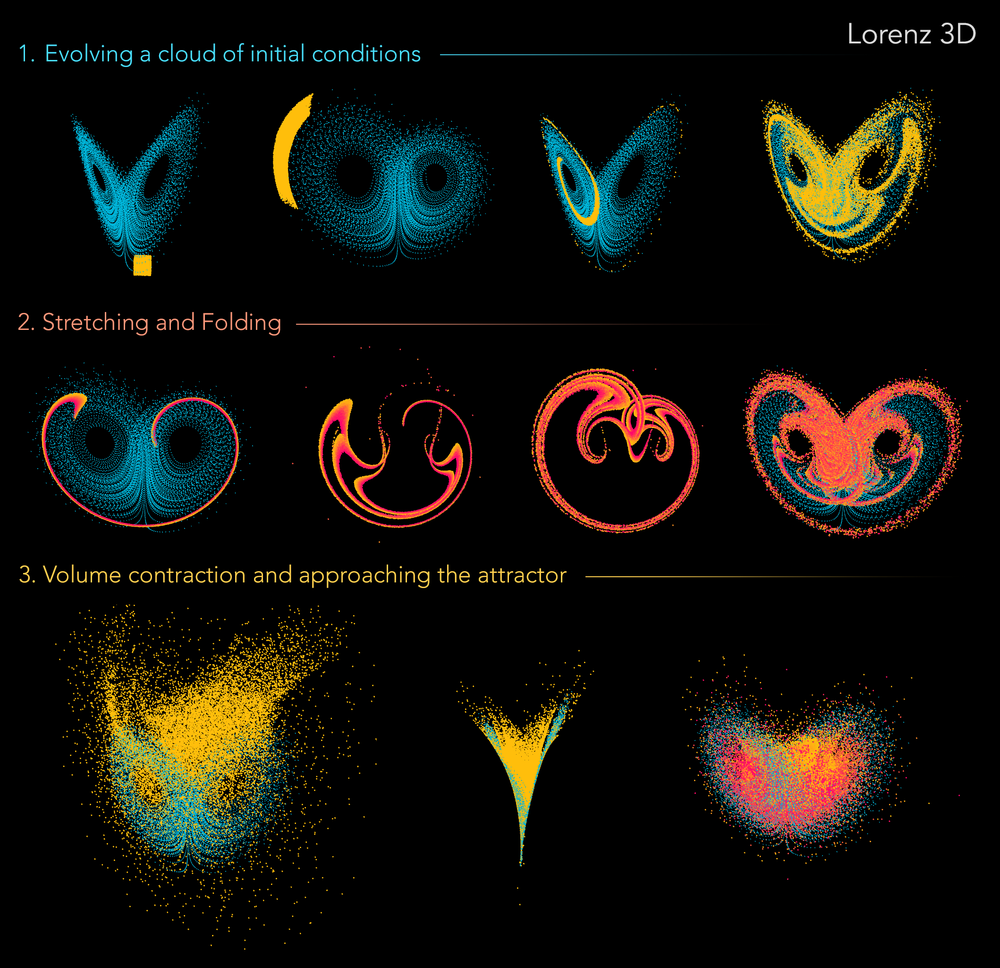

# IDC601 - Nonlinear Dynamics and Chaos   
Instructor: Siddhartha Mukherjee ([Website](https://www.sm-iitk.in/))  
Semester: 2025-26-I  
Indian Institute of Technology, Kanpur  

---
Numerical tools and visualization codes used during the course can be found here. These are shared as Jupyter Notebooks and Processing sketches. Below are useful references and recommended (⭐) reading material for and beyond the course.

## Interactive Visualizations with Processing

This is a set of special tools developed to let you test and play with numerical integration of dynamical systems, focusing on visualization and interactivity. To run these codes, you need to download [Processing](https://processing.org/) which is an amazing platform (freely available) for making generative art and visual programming. The codes have been written in Java.

1. **Flow 2D (Basic)** - To visualize flow fields from 2D systems (both linear and nonlinear), and to evolve trajectories bly clicking.
1. **Flow 2D (Advanced)** - With additional functionality allowing you to zoom in and out of the vector field, show fixed points, nullclines, toggle grid, vectors etc.   
1. **Complex Transformation** - To visualize the transformation of the complex plane under z -> z^n.
1. **Dynamics on a Torus** - Coupled oscillators (or any other 2pi period 2D systems) evolving on a Torus. You can click to add trajectories, toggle phase-plane view etc.
1. **Lorenz Pair** - Visualize evolution of 2 nearby trajectories under the Lorenz equations, with x(t) vs (t) and phase-plane projections, can toggle views, symbolic dynamics etc.
1. **Lorenz 3D** - Visualize a cloud of initial conditions evolving on the Lorenz attractor in 3D, with controls to reset and pause evolution, rotation in 3D, colour trajectories etc.

## References

1. ⭐**Steven H. Strogatz – *Nonlinear Dynamics and Chaos***  
   Chapman & Hall, 2024 (3rd Edition), ISBN 9781032791654.   
   *Main textbook followed during the course. Excellent to help build intuition and a powerful, visual way of thinking.*

1. **John Guckenheimer and Philip Holmes – *Nonlinear Oscillations, Dynamical Systems, and Bifurcations of Vector Fields***  
   Springer, 1983 (Applied Mathematical Sciences, Vol. 42), [DOI](https://doi.org/10.1007/978-1-4612-1140-2).  
   *Essential reference for mathematically deep and comprehensive coverage of topics.*

1. **Edward Ott – *Chaos in Dynamical Systems***  
   Cambridge University Press, 2002 (2nd Edition), [DOI](https://doi.org/10.1017/CBO9780511803260).  
   *Particularly for strange attractors, fractals, and chaos in physical systems.*

1. **Stephen Smale, Morris Hirsch and Robert Devaney – *Differential Equations, Dynamical Systems, and an Introduction to Chaos***
   Academic Press, 2012 (3rd Edition), ISBN 9780128100158.  
   *A broad range of topics, clear and mathematical.*

## Other Books
- ⭐**James Gleick – *Chaos: Making a New Science***  
   Penguin USA, 2008 (reprint), ISBN 9780143113454.  
   *A very engaging book about the history and discovery of chaos theory.*

- **Ilya Prigogine & Isabelle Stengers - *Order Out of Chaos: Man's New Dialogue with Nature***  
  Bantam New Age Books, 1984, ISBN 9780553340822.  
  *A physicist (Prigogine) and a philosopher (Stengers) muse how two great themes of classic science, order and chaos, which coexisted uneasily for centuries, are being reconciled.*

## Articles

The Papers folder includes some interesting papers mentioned/discussed during the lectures. Here are some more recommended resources and interesting articles:

- **Hairy Ball Theorem**  
  Some suprising implications of the [Hairy Ball Theorem](https://www.scientificamerican.com/article/maths-hairy-ball-theorem-has-surprising-implications/).

- **Topological Defects**  
  Phyical Review Letters involving topological defects in various contexts, that also have an accompanying, [Featured in Physics](https://journals.aps.org/search/results?clauses=%5B%7B%22field%22:%22all%22,%22value%22:%22topological+defect%22,%22operator%22:%22AND%22%7D%5D&sort=relevance&per_page=20&category=physics) article.

- ⭐**The Hidden Heroines of Chaos**  
  Two women programmers played a pivotal role in the birth of Chaos Theory. Their previously untold [story](https://www.quantamagazine.org/the-hidden-heroines-of-chaos-20190520/) illustrates the changing status of computation in science.
